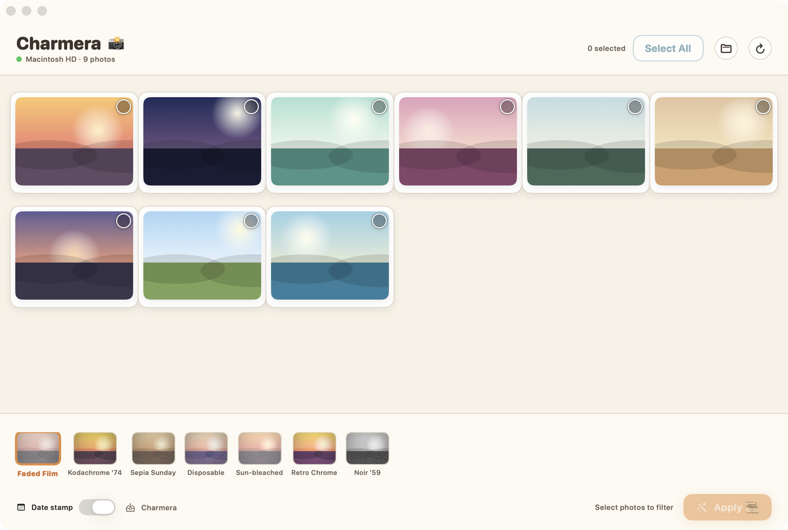

<p align="center">
  
</p>

<h1 align="center">Charmera 📸</h1>

<p align="center">
  A cute little macOS app (SwiftUI) that reads photos off a connected <b>Kodak
  Charmera</b> (or any camera card with a <code>DCIM</code> folder), shows them
  in a gallery, lets you multi-select, and applies nostalgic film filters to the
  whole batch in one go.
</p>

<p align="center">
  
</p>

## Features

- **Auto-detects the camera** — scans every mounted volume for a `DCIM` folder,
  so plugging in the Charmera just works. Also lets you pick a folder by hand.
- **Fast gallery** — polaroid-style tiles with ImageIO thumbnails, tap to
  multi-select, Select All / Clear.
- **7 nostalgic filters** with live previews rendered on your photo:
  Faded Film 🎞 · Kodachrome '74 ☀️ · Sepia Sunday 📜 · Disposable ⚡️ ·
  Sun-bleached 🌻 · Retro Chrome 🪩 · Noir '59 🖤
- **Batch apply + export** — filters run at full resolution via Core Image and
  save copies (originals on the card are never touched). Default output:
  `~/Pictures/Charmera`.
- **Optional retro date stamp** — the classic glowing-orange corner date.

## Building & running

This app uses SwiftUI, whose `@State`/`@Binding` are **macros** in the current
SDK. Their compiler plugin ships only with **full Xcode**, so the Command Line
Tools alone can't build it.

1. Install **Xcode** from the App Store.
2. Point the toolchain at it (one time):
   ```sh
   sudo xcode-select -s /Applications/Xcode.app
   ```
3. Build and launch:
   ```sh
   ./build.sh
   open Charmera.app
   ```

`build.sh` compiles the sources with `swiftc` and wraps the binary in a proper
`Charmera.app` bundle (Dock icon, menu bar, and the removable-volume access
prompt). If macOS asks to access files on a removable volume, click **Allow** so
the app can read the camera card.

## Project layout

```
Sources/Charmera/
  CharmeraApp.swift      # @main app + window
  Theme.swift            # warm film palette + button styles
  Models.swift           # PhotoItem, ExportState
  PhotoLibrary.swift     # camera detection + thumbnail loading (ImageIO)
  Filters.swift          # Core Image recipes, previews, full-res export, date stamp
  AppModel.swift         # app state, selection, batch export orchestration
  Views/
    ContentView.swift    # layout + empty state
    HeaderView.swift     # wordmark, status, selection controls
    GalleryView.swift    # grid + photo cells
    FilterBar.swift      # filter preview chips + apply row
    ExportBanner.swift   # floating progress / done banner
```

```
tools/
  make_icon.swift        # regenerates the app icon (Core Graphics)
  make_samples.swift      # generates sample photos for testing / screenshots
docs/                     # icon + screenshot used in this README
```

`Package.swift` is included for building in Xcode via SwiftPM if you prefer.

## Development

Test the gallery, filters and export without the camera by pointing the app at
any folder of JPEGs via an environment variable (run the binary directly, since
`open` doesn't forward env vars):

```sh
CHARMERA_FOLDER=/path/to/photos ./Charmera.app/Contents/MacOS/Charmera
```

Regenerate the assets:

```sh
swiftc tools/make_icon.swift -o /tmp/mkicon && /tmp/mkicon /tmp/AppIcon.png
swiftc tools/make_samples.swift -o /tmp/mksamples && /tmp/mksamples ~/Desktop/samples
```

